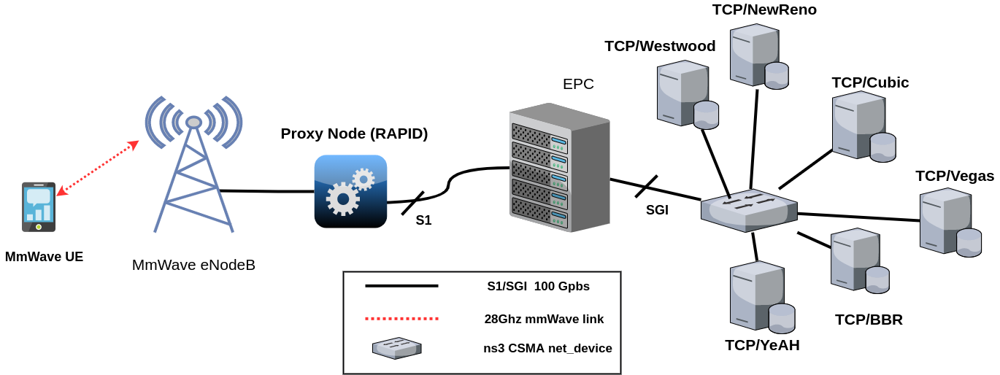

# RAPID
RAPID (RAN-Aware Proxy-based flow control for HIgh througput and low Delay eMBB) is a TCP proxy that aims to mitigate self-inflicted bufferbloat and maximize link utilization in today and future cellular networks. RAPID exploits real-time radio information and arrival rates of the concurrent flows in order to distribute proportionally the available RAN bandidth. Find below the required steps in order to reproduce the results shown in the paper.



# 1. Building the simulation environment

## 1.1 Legacy ns3 with mmWave

The commands below build ns3 with mmWave module and Full-duplex CSMA support. All the simulations that don't involve RAPID should be run on this legacy version. 

```

cd ns3-mmwave/
./waf clean
CXXFLAGS="-Wall" ./waf configure --build-profile=optimized
./waf

```

## 1.2 Modified ns3 with RAPID

The commands below build a modified ns3 with mmWave and RAPID support. The simulations that require RAPID should be run on this modified version.

```
cd rapid/
./waf clean
CXXFLAGS="-Wall" ./waf configure --build-profile=optimized
./waf

```
# 2. Reproducing the scenatios/results shown in the paper: Cubic vs BBR
## 2.1 Fast Download in LOS
### Without RAPID
From the root repository (RAPID), go to the legacy ns3 directory (ns3-mmwave) and launch the script "start-los.sh" as follows:

```
$cd ns3-mmwave/
$./start-los.sh -h
[usage]: ./start-los.sh <scen>  <run1,runn> <simTime> <data> <stream> <buff> <rtt>
$./start-los.sh 0 1,2,3,4,5,6,7,8,9,10 200 2 10 1

```
